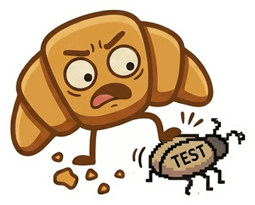

# Contributing to notmyfault

Thanks for helping! Contributions of every size are welcome. Everyone taking part in this project is expected to follow the [code of conduct](CODE_OF_CONDUCT.md).

## Ways to help



- **A report is misread?** [Open an issue](https://github.com/tashikomaaa/notmyfault/issues) with the JUnit XML file, anonymized if needed, and the runner and version that produced it. Real reports become test fixtures, and they are the most valuable contribution there is.
- **A verdict looks wrong?** Describe the history of the test (you can print it, see the [FAQ](docs/faq.md#how-do-i-look-at-the-raw-data)) and what you expected.
- **The documentation is unclear?** Documentation fixes are as welcome as code.

## Development

Requirements: Node.js 24 and git.

```sh
npm ci
npm run check   # typecheck, build dist/ and run all tests
```

| Script | What it does |
|---|---|
| `npm run typecheck` | Type-checks sources, tests and scripts |
| `npm run build` | Bundles `src/` with esbuild into `dist/index.js`, the GitHub Action, and `dist/notmyfault.mjs`, run in GitLab CI/CD |
| `npm test` | Runs the test suite with Vitest |

`dist/index.js` is what GitHub Actions runs and `dist/notmyfault.mjs` what GitLab jobs download, so both are committed. **Run `npm run build` and commit `dist/` with your changes**: CI fails when `dist/` does not match the sources.

## Project layout

| Path | Role |
|---|---|
| `src/index.ts` | Entry point of the GitHub Action |
| `src/cli.ts` | Entry point of `notmyfault.mjs`, which detects the CI system |
| `src/main.ts` | Orchestration: inputs, reports, history, verdicts, outputs |
| `src/platform.ts` | What notmyfault needs from a CI system: context, inputs and outputs, API |
| `src/xml.ts` | Forgiving XML parser |
| `src/junit.ts` | JUnit report reading, test identity, retries |
| `src/history.ts` | History format and recording rules |
| `src/analyze.ts` | Classification and ranking |
| `src/locate.ts` | Finding the file and line of a failed test, for annotations |
| `src/flaky-issues.ts` | Deciding which flaky test issues to open, update and close |
| `src/report.ts` | Pull request comment and job summary rendering |
| `src/git-store.ts` | Reading and writing the history branch |
| `src/github/` | GitHub Actions: environment and event payload, inputs and outputs without `@actions/core`, REST API client |
| `src/gitlab/` | GitLab CI/CD: predefined variables, `NOTMYFAULT_*` variables, dotenv and Code Quality reports, REST API client |
| `templates/` | The GitLab CI/CD template |
| `test/` | Unit tests, JUnit fixtures and end-to-end tests |
| `docs/` | Documentation, mirrored to the wiki. Images are in `docs/assets/` |
| `brand/` | Original artwork: mascot, banner, badges, stickers. See [brand/README.md](brand/README.md) |
| `scripts/wiki.ts` | Converts `docs/` into wiki pages |
| `site/` | The website at [notmyfault.aldwin.fr](https://notmyfault.aldwin.fr) |
| `scripts/site.ts` | Builds `site/` with the images it shares with `docs/assets/` |

[How it works](docs/how-it-works.md) describes the behavior these files implement.

## Principles

- **No runtime dependencies.** Everything the action runs is in this repository. Development dependencies are fine.
- **Never break a build because of notmyfault's own infrastructure.** If the history or the API is unavailable, warn and carry on.
- **Fail closed in quarantine mode.** When in doubt, a failure blocks.
- **Every verdict must be explainable** in one sentence of the pull request comment.
- **Code, comments and documentation are written in English.**

## Tests

- Unit tests sit next to the module they cover: `test/junit.test.ts` for `src/junit.ts`, and so on.
- JUnit samples live in `test/fixtures/junit/`. Add one for each runner-specific behavior.
- `test/git-store.test.ts` runs against real git repositories, including concurrent writers.
- `test/main.test.ts` simulates complete workflow runs, with a local bare repository and a fake GitHub API. `test/gitlab/run.test.ts` does the same for GitLab pipelines.
- `test/dist.test.ts` runs the bundled `dist/index.js` as GitHub Actions would, and `dist/notmyfault.mjs` as a GitLab job would.
- `test/docs.test.ts` checks that documentation links resolve and that every input and output is documented.
- `test/site.test.ts` builds the website and checks that every file it links to exists.

## Documentation

`docs/` is the source of truth. The [wiki](https://github.com/tashikomaaa/notmyfault/wiki) is regenerated from it by the `Wiki` workflow on every push to `main`: edits made directly in the wiki are overwritten.

Images go in `docs/assets/` and are referenced with relative paths, in Markdown or in HTML `src` attributes: the wiki conversion points them at the repository. The originals they are cut from are in [brand/](brand/README.md). The `verdict-*.png` badges are also linked from every pull request comment notmyfault posts: never rename or remove them.

To preview the wiki conversion locally:

```sh
mkdir -p /tmp/notmyfault-wiki
node scripts/wiki.ts docs /tmp/notmyfault-wiki tashikomaaa/notmyfault
```

## Website

[notmyfault.aldwin.fr](https://notmyfault.aldwin.fr) is a static page in `site/`, with no build tool. It uses the images of `docs/assets/`, copied in when it is built, and self-hosted fonts under the SIL Open Font License. The `Site` workflow deploys it on every push to `main` that changes it.

To preview it locally:

```sh
npm run site
npx serve _site   # or any static file server
```

The server sends a strict content security policy: no inline styles or scripts, and nothing loaded from other domains.

## Pull requests

- Keep each pull request focused on one change.
- Add or update tests with behavior changes, and the documentation with user-visible changes.
- Add an entry to the `Unreleased` section of [CHANGELOG.md](CHANGELOG.md).
- Make sure `npm run check` passes and `dist/` is rebuilt.

## Releasing

For maintainers:

1. Move the `Unreleased` entries of `CHANGELOG.md` under the new version.
2. `npm version X.Y.Z --no-git-tag-version`, then `npm run check`.
3. Commit as `Release X.Y.Z`, tag `vX.Y.Z` and move the major tag:

   ```sh
   git tag -a vX.Y.Z -m "notmyfault X.Y.Z"
   git tag -fa vX -m "notmyfault vX (currently X.Y.Z)"
   git push origin main vX.Y.Z
   git push origin vX --force
   ```

4. Create a GitHub release from `vX.Y.Z` with `dist/notmyfault.mjs` attached, and publish it to the Marketplace:

   ```sh
   gh release create vX.Y.Z dist/notmyfault.mjs --title "notmyfault X.Y.Z" --notes-file notes.md
   ```
