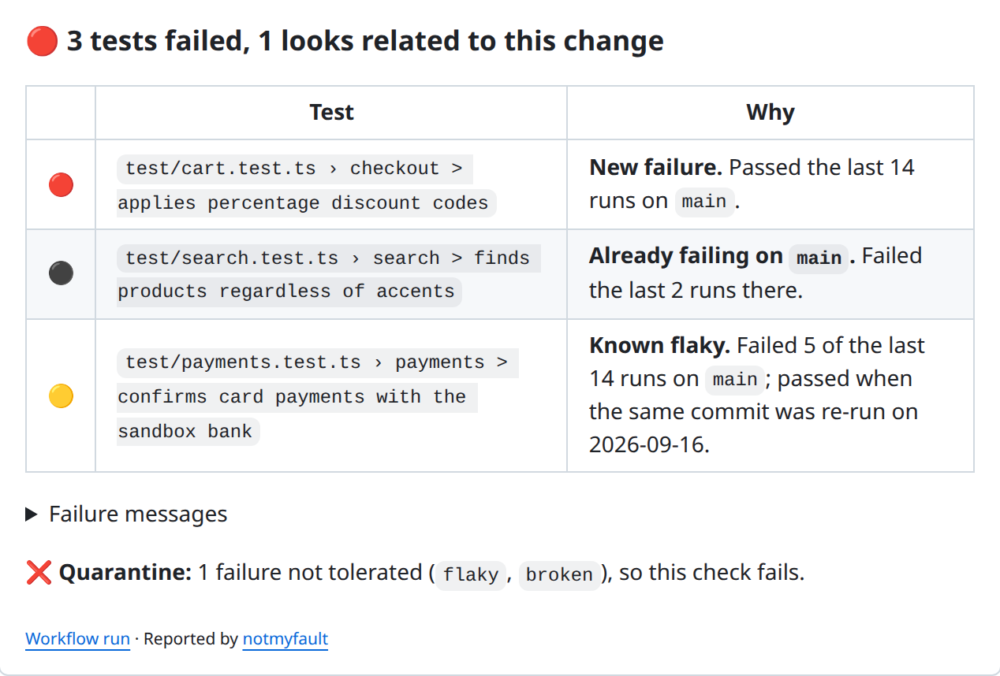

<div align="center">


**A test just failed on your pull request. Is it your fault?**

[](https://github.com/tashikomaaa/notmyfault/actions/workflows/ci.yml)
[](https://github.com/tashikomaaa/notmyfault/releases)
[](https://github.com/marketplace/actions/notmyfault-flaky-test-detector)
[](LICENSE)
[](docs/recipes.md#show-a-flaky-tests-badge)

[Website](https://notmyfault.aldwin.fr) · [Getting started](docs/getting-started.md) · [Documentation](docs/README.md) · [Live demo](https://github.com/tashikomaaa/notmyfault-demo/pull/1) · [Changelog](CHANGELOG.md)

</div>

notmyfault is a GitHub Action that remembers how every test behaves on your default branch. When a pull request turns red, it tells you which failures are **new**, which tests are **known to be flaky** and which were **already broken** before you touched anything.

<p align="center">
  <a href="https://github.com/tashikomaaa/notmyfault-demo/pull/1">
    <picture>
      <source media="(prefers-color-scheme: dark)" srcset="docs/assets/pr-comment-dark.png">
      
    </picture>
  </a>
  <br>
  <sub>A real comment, on <a href="https://github.com/tashikomaaa/notmyfault-demo/pull/1">this pull request</a> of the <a href="https://github.com/tashikomaaa/notmyfault-demo">demo repository</a>.<br>More of them: <a href="https://github.com/tashikomaaa/notmyfault-demo/pull/2">a suspect failure</a>, <a href="https://github.com/tashikomaaa/notmyfault-demo/pull/3">nothing is your fault</a>, <a href="https://github.com/tashikomaaa/notmyfault-demo/pull/4">green again after a fix and a re-run</a>.</sub>
</p>

## Why notmyfault

<p align="center">
  
</p>

- **Stop re-running builds blindly.** Every failure comes with a verdict and the evidence behind it.
- **See it next to the code.** Failed tests are annotated with their verdict in the Files changed tab.
- **Stop flaky tests from blocking merges.** [Quarantine mode](docs/quarantine.md) fails the check only for failures that look real.
- **Nothing to host.** No server, no account, no SaaS: the history lives on a branch of your own repository.
- **Nothing to audit but this repository.** Zero runtime dependencies, one bundled file, rebuilt and verified by CI.
- **Any test runner.** Everything that writes JUnit XML: Vitest, Jest, pytest, Go, Maven, Gradle, cargo-nextest, Playwright, PHPUnit, RSpec, .NET…

## Quick start

Make your tests write JUnit XML, then add notmyfault after the test step:

```yaml
on:
  push:
    branches: [main]
  pull_request:

permissions:
  contents: write        # store the history on the notmyfault-history branch
  pull-requests: write   # comment on pull requests

jobs:
  test:
    runs-on: ubuntu-latest
    steps:
      - uses: actions/checkout@v7
      - run: npm ci
      - run: npx vitest run --reporter=default --reporter=junit --outputFile.junit=reports/junit.xml

      - uses: tashikomaaa/notmyfault@v1
        if: ${{ !cancelled() }}
        with:
          junit: reports/**/*.xml
```

Runs on `main` build the history, pull requests are compared with it. The [getting started guide](docs/getting-started.md) walks through it, and [Test runners](docs/test-runners.md) shows how to produce JUnit XML with other runners.

## How it decides

| | Verdict | Meaning |
|:---:|---|---|
|  | **New failure** | Nothing in the history explains it, or it failed with an error never seen on `main`. Probably caused by the change. |
|  | **Suspect** | Failed in isolation once or twice on `main`. Re-run to find out. |
|  | **Already failing** | The latest runs on `main` failed too. Not your fault. |
|  | **Flaky** | *Known flaky* when a retry or a re-run of the same commit proved it, *probably flaky* when it keeps failing in isolation. Not your fault. |

Every rule and threshold is documented in [Reading the report](docs/verdicts.md) and [How it works](docs/how-it-works.md).

## Documentation

| | |
|---|---|
| **Guides** | [Getting started](docs/getting-started.md) · [Quarantine flaky tests](docs/quarantine.md) · [Test runners](docs/test-runners.md) · [Recipes](docs/recipes.md) |
| **Reference** | [Reading the report](docs/verdicts.md) · [Configuration](docs/configuration.md) · [How it works](docs/how-it-works.md) · [Permissions and security](docs/security.md) |
| **Help** | [Troubleshooting](docs/troubleshooting.md) · [FAQ](docs/faq.md) |

## Contributing

Issues and pull requests are welcome, and JUnit reports that notmyfault misreads are especially valuable. See [CONTRIBUTING.md](CONTRIBUTING.md) and the [code of conduct](CODE_OF_CONDUCT.md). Security issues: [SECURITY.md](SECURITY.md).

## License

[MIT](LICENSE)
