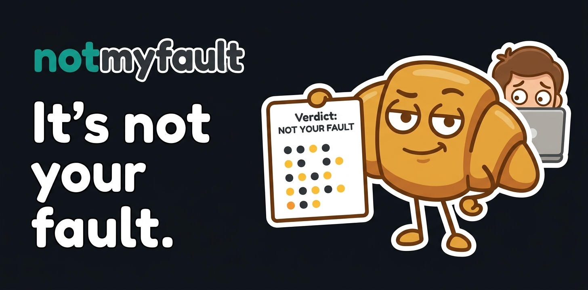
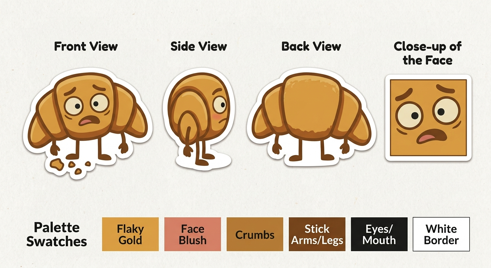
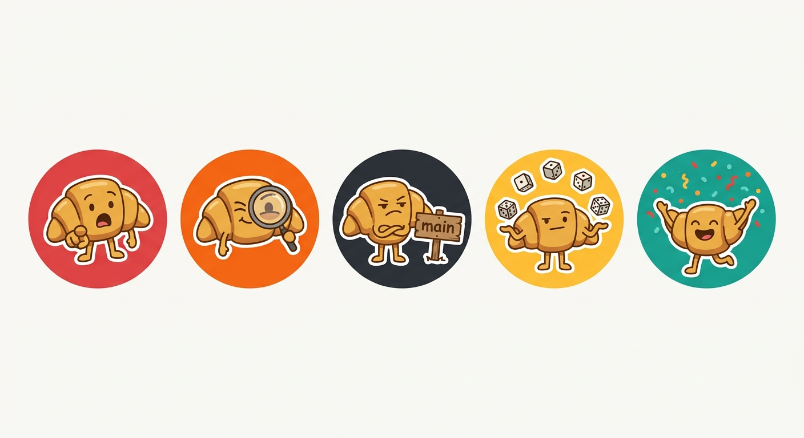
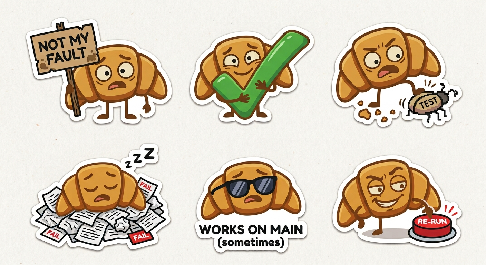
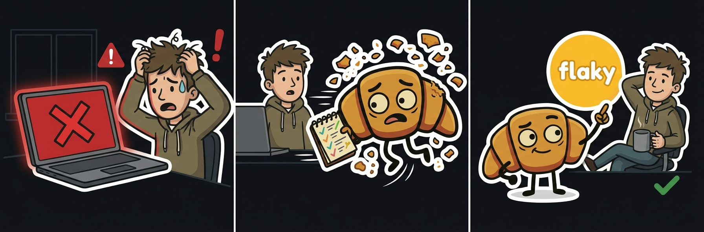
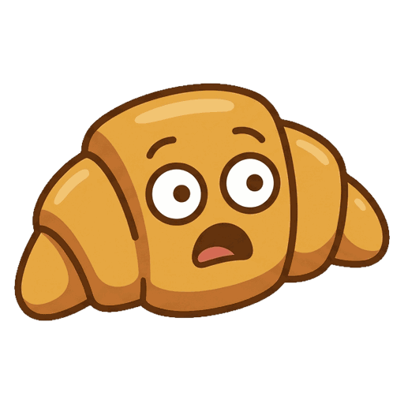

# notmyfault brand

  

notmyfault's mascot is a croissant: the flakiest thing there is. It worries when a build turns red, checks the history and, most of the time, finds out that it was not your fault.

This directory holds the original artwork. The images used by the README, the documentation, the wiki and the issue forms are derived from it and live in [docs/assets/](../docs/assets).

## The mascot

  

- It always has a **thick white sticker border**, which keeps it readable on light and dark backgrounds.
- Its outlines, arms and legs are **dark brown**, never black.

## Palette

| Color | Hex | Used for |
|---|---|---|
| Flaky gold | `#DA9D42` | The croissant |
| Crumbs | `#B47933` | Shading, crumbs |
| Stick brown | `#75441B` | Outlines, arms and legs |
| Face blush | `#D58066` | Cheeks, tongue |
| Ink | `#1B1B19` | Eyes, mouth |
| Border white | `#FFFFFF` | Sticker border |
| Night | `#0F141A` | Banner and comic backgrounds |
| Teal | `#139889` | The "not" of the logotype |

## Verdict badges

  

Each verdict has a badge whose color matches the emoji of the pull request comment.

| Badge | Verdict | Color | File |
|:---:|---|---|---|
|  | 🔴 New failure | `#DC4444` | [verdict-new.png](../docs/assets/verdict-new.png) |
|  | 🟠 Suspect | `#F26514` | [verdict-suspect.png](../docs/assets/verdict-suspect.png) |
|  | ⚫ Already failing | `#2D3137` | [verdict-broken.png](../docs/assets/verdict-broken.png) |
|  | 🟡 Known flaky / Probably flaky | `#FCBD34` | [verdict-flaky.png](../docs/assets/verdict-flaky.png) |
|  | ✅ All tests passed | `#19A08E` | [verdict-passed.png](../docs/assets/verdict-passed.png) |

## Stickers

  

| Sticker | File | Used in |
|:---:|---|---|
|  | [sticker-not-my-fault.png](../docs/assets/sticker-not-my-fault.png) | FAQ, "wrong verdict" issue form |
|  | [sticker-passed.png](../docs/assets/sticker-passed.png) | Getting started |
|  | [sticker-bug.png](../docs/assets/sticker-bug.png) | Test runners, contributing, bug report issue form |
|  | [sticker-asleep.png](../docs/assets/sticker-asleep.png) | Troubleshooting |
|  | [sticker-works-on-main.png](../docs/assets/sticker-works-on-main.png) | Quarantine flaky tests |
|  | [sticker-rerun.png](../docs/assets/sticker-rerun.png) | Getting started |
|  | [mascot.png](../docs/assets/mascot.png) | FAQ, "misread report" issue form |

## Comic strip

  

The whole pitch in three panels, shown in the README and on the documentation home page.

## Logo and favicon

  

[logo.png](logo.png) is the head of the mascot on a transparent background, 512 × 512 pixels, for avatars and favicons. [favicon.jpg](favicon.jpg) shows how it reads at 32 and 16 pixels on light and dark backgrounds.

## Social preview

[social-preview.jpg](social-preview.jpg) is the banner at 1280 × 640 pixels, the size GitHub expects. Upload it in the repository **Settings**, under **Social preview**: GitHub has no API for it.

## Files

| Original | Derived |
|---|---|
| [banner.jpg](banner.jpg) | [banner.jpg](../docs/assets/banner.jpg), recompressed. [social-preview.jpg](social-preview.jpg) |
| [comic-strip.jpg](comic-strip.jpg) | [comic-strip.jpg](../docs/assets/comic-strip.jpg), 1600 pixels wide |
| [verdict-badges.jpg](verdict-badges.jpg) | `verdict-*.png`, cut out along the circle |
| [stickers.jpg](stickers.jpg) | `sticker-*.png`, background removed around the white border |
| [character-sheet.jpg](character-sheet.jpg) | [mascot.png](../docs/assets/mascot.png), the front view |
| [favicon.jpg](favicon.jpg) | [logo.png](logo.png) |

Derived PNG files are 256-color images with transparency, which keeps each of them under 25 KB.
