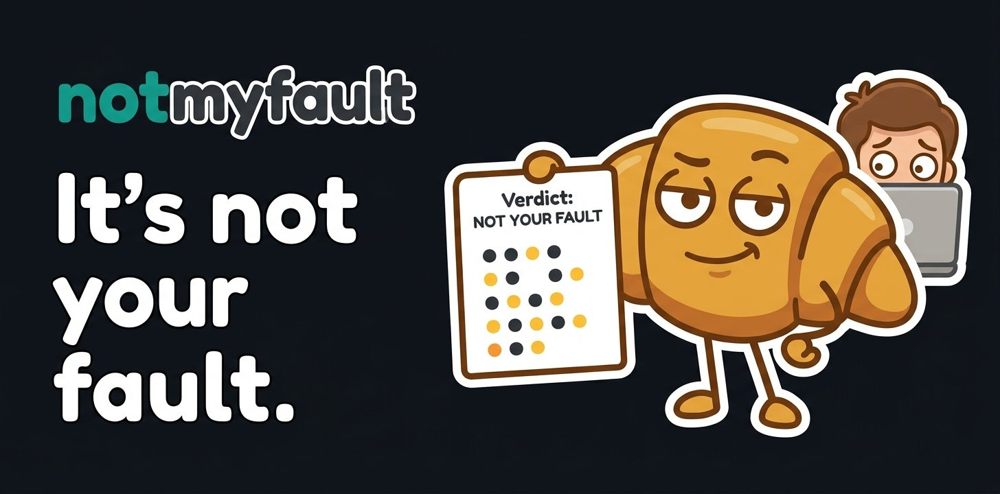

# notmyfault documentation

  

notmyfault is a GitHub Action that remembers how every test behaves on your default branch, then tells each pull request whether a failing test is **new**, **known to be flaky** or **already broken**.

  

## Start here

- [Live demo](https://github.com/tashikomaaa/notmyfault-demo/pulls): real pull requests showing every verdict, see [Live examples](verdicts.md#live-examples).
- [Getting started](getting-started.md): add notmyfault to a workflow in five minutes.
- [Reading the report](verdicts.md): what each verdict means and what to do about it.

  
  
  
  
  

## Guides

- [Quarantine flaky tests](quarantine.md): stop known flaky tests from blocking merges.
- [Test runners](test-runners.md): produce JUnit XML with Vitest, Jest, pytest, Go, Maven, Gradle, Rust, Playwright and more.
- [Recipes](recipes.md): several suites, monorepos, sharding, matrices, nightly runs, merge queues.

## Reference

- [Configuration](configuration.md): every input and output, and when the step fails.
- [How it works](how-it-works.md): test identity, the history branch, the classification rules and the limits.
- [Permissions and security](security.md): tokens, stored data, pull requests from forks.
- [Troubleshooting](troubleshooting.md): every warning and error, explained.
- [FAQ](faq.md)

## Contributing

Bug reports, sample JUnit files from runners that misbehave, and pull requests are welcome. See [CONTRIBUTING.md](../CONTRIBUTING.md).
